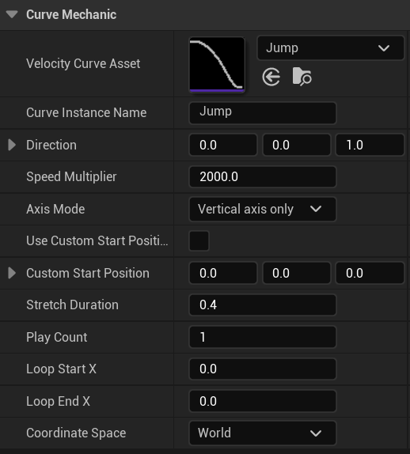

# ╭╰ Kurveball ╭╰

Kurveball is a curve-driven movement and animation library designed to replace complex movement code with intuitive visual graphs. 

Instead of writing code to create movement, you define a velocity curve: a simple graph where the horizontal axis is time and the vertical axis is speed. Kurveball reads this graph, performs the necessary calculus integration, and drives your character's velocity, position, and rotation automatically. Motion can be looped, blended, time-stretched, speed-stretched, bound to 3D splines, masked by axis, and more.

 
*(Click for YouTube version)*

## 🪶 Philosophy

Character movement is a complex math problem, but *designers* should see it as a visual art. They should be able to tweak a jump, dash, or slide by shaping a curve, *not* by memorizing dozens of physics parameters or changing numbers by trial and error.

---

## CurveMechanic Tweakables

CurveMechanic is the definition of your movement mechanic. It points to the velocity curve you want to use, the speed you want to play it at, and any special parameters such as looping, time-stretching, or axis masking.

 
* Velocity Curve Asset: The curve that controls the entity's speed. In Unreal, this is a CurveFloat. y=0 is stopped, y=1 is top speed.
* Curve Instance Name: A unique name that you specify. You'll use this to start, update, and stop the mechanic.
* Direction: The direction you want to go, specified in terms of the Coordinate Space you choose below.
* Coordinate Space: Choose whether you want the velocity curve to run in local space (relative to the actor's rotation) or in world space (absolute coordinates).
* Speed Multiplier: The scale factor for your mechanic. This is automatically multiplied with the vertical axis of your Velocity Curve Asset to generate the final speed.
* Axis Mode: Masks the mechanic's output so that it only affects the axes you want, leaving the others alone. Possibilities are allMovementAxes, horizontal, vertical, yaw, pitch, and roll.
* Start Time: If zero, start now. Or specify a positive number of seconds to start later.
* Stretch Duration: Zero means to play the velocity curve with no stretching, at its authored duration. Otherwise, specify a number of seconds to smoothly timestretch the curve's duration.
* Play Count: By convention, a play count of zero means "loop forever." Any other count is interpreted literally, e.g. 1 to play the curve once in total.
* Loop Start X and Loop End X: Loop points allow you to customize which part of the curve gets looped. In this way, you can create a curve with an intro that plays once, a looped midsection that plays some number of times according to PlayCount, and an outro that plays once. Zero means to loop the whole curve.

## 📐 How to Use in Unreal Engine

Take at look at Examples/UnrealCurveDemo for a working example.

To use in your own project, put Kurveball under your Source directory and add VelocityCurveComponent to your actor. This wrapper automatically applies the velocity curves' position and rotation. With the component added, you can call all of the API functions (like StartVelocityCurve) directly from Unreal Blueprint. Kurveball is compatible with Unreal's CurveFloat type, so you can use Unreal's native editor to draw your velocity curves. No conversion needed.

Wrappers for other engines are on the roadmap! Godot is next in line after Unreal.

---

## 🔩 Other Platforms and Engines

Kurveball is not dependent on any specific platform or engine. It doesn't care which axis is up, what the world units are, or how your engine works. Just be consistent with your units and axes, start your mechanic with `Kurveball::StartVelocityCurve()`, and call `Kurveball::TickPlayback()`. The library handles the rest, storing the output position, rotation, and velocity in `VelocityCurveContext`.

---

## 📦 Architecture & Extensibility

Kurveball is split into two layers:
1.  **Core (`Kurveball` namespace):** No dependencies on any specific engine. Handles math, Bezier curves, integration, and data structures. Pure C++ and STL, with the option to swap in eastl or another container library just by editing a few `using` directives.
2.  **Wrappers:** Engine-specific adapters. These translate engine types into Core types, hook up the designer-facing functions in VelocityCurveApi.h to visual scripting, apply the curve results to your actor's position and rotation. 

**Adding an Engine Wrapper:**
To port to a custom engine:
1.  `#include Kurveball/Source/KurveballAll.h`
2.  Implement a wrapper for `VelocityCurveContext`.
3.  Map your engine's vector types to `Kurveball::Float3`.
4.  Implement a `CurveSampler` for your engine's curve asset type.

---

## 📄 License
MIT Non-AI License. Copyright (c) 2026 Jake Hart.

This means that you may *not* use this code to *train* AI, or in any form of AI research. However, you *are* allowed to use the code in game projects that *use* AI. See LICENSE.md for details.

---

## 🤝 Contributing
If you find bugs, have ideas for new features, or want to help build a wrapper for your favorite engine, issues and PRs are welcome!

---

### 💡 Why use Kurveball?
*   **For Designers:** You'll be able to create movement and camera mechanics independently and without intervention from engineers. Iterate on movement feel in seconds by shaping a curve.
*   **For Programmers:** You'll be freed from having to implement code for individual character movement mechanics or cameras.
*   **For Artists:** You'll be able to create precise, reproducible animations that sync perfectly with gameplay. You'll know the exact root motion curve of the motion in-game.